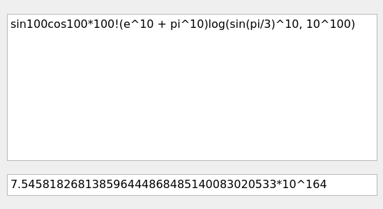

<p align="center">
  
</p>

---

<p align="center">
  <a href="https://github.com/fintarin/Fintamath/actions/workflows/ci-build.yml">
    
  </a>

  <a href="https://sonarcloud.io/summary/new_code?id=fintarin_Fintamath">
    
  </a>

  <a href="https://codecov.io/gh/fintarin/Fintamath">
    
  </a>
</p>

Fintamath is an application for solving mathematical expressions with arbitrary precision.

## Features

* Supports integers & rationals
* Supports basic math operators
* Supports most of the elementary mathematical functions list
* Supports factorials
* Supports mathematical constants

## Examples

<p align="center">
  
</p>


## Installation

Tested on Ubuntu 20.04.

### Install dependencies

```sh
sudo apt-get update
sudo apt-get install qt5-default
```

### Clone repository

```sh
git clone https://github.com/fintarin/Fintamath.git
cd Fintamath
git submodule update --init
```

### Build

```sh
cmake -B build -DCMAKE_BUILD_TYPE=Release
cmake --build build
```

### Run

```sh
./build/bin/fintamath
```

## Planned features

* Supporting reals
* Supporting variables
* Supporting equations
* Increasing speed & precision
* Protting graphics
* LaTex inputting and outputting
